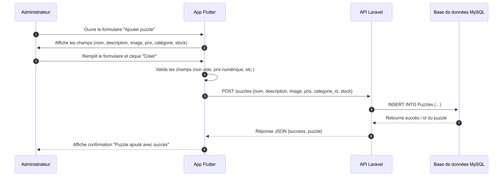
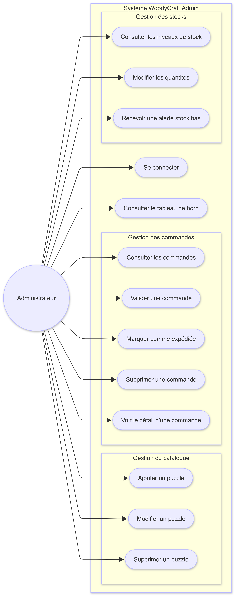
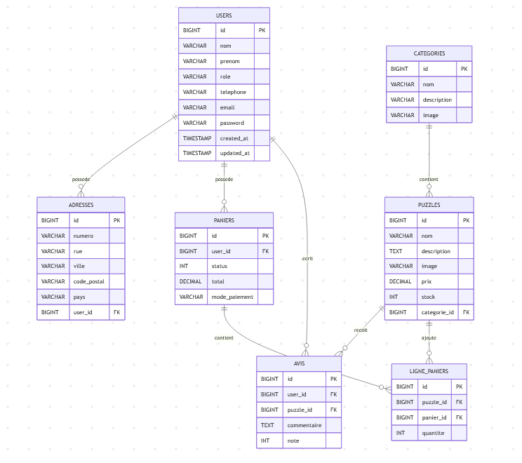

# Situation_Pro_2

## Sommaire

- [Présentation du besoin métier](#présentation-du-besoin-métier)
- [Architecture du projet](#architecture-du-projet)
- [Modélisation UML](#modélisation-uml)
- [Modélisation de la base de données](#modélisation-de-la-base-de-données)
- [Plan de sauvegarde des données](#plan-de-sauvegarde-des-données)
- [Maquette](#maquette)


## Présentation du besoin métier

### Contexte

WoodyCraft est une entreprise qui vend des puzzles en ligne. Elle dispose déjà d'une application web (SP1) et souhaite aujourd'hui se doter d'une **application mobile d'administration** pour piloter son activité au quotidien.

### Problématique

L'administrateur de WoodyCraft n'a actuellement **aucun outil mobile** pour gérer les commandes, le catalogue et les stocks en temps réel. Cela ralentit les opérations et peut entraîner des erreurs (ruptures de stock non détectées, commandes non traitées, etc.).

### Objectif

Développer une **application mobile administrative** permettant à l'administrateur de gérer efficacement :

- Les commandes clients
- Le catalogue de puzzles
- Les niveaux de stock

### Acteurs

Administrateur : Utilisateur principal de l'application
Client : Passe des commandes via l'application web existante 
Système : API RESTful partagée avec l'application web

### Besoins fonctionnels

#### Gestion du catalogue
- Ajouter, modifier et supprimer des puzzles
- Mettre à jour les informations : prix, description, image

#### Gestion des commandes
- Consulter les commandes en attente
- Valider, marquer comme expédiée ou supprimer une commande
- Voir le détail d'une commande (articles, adresse, paiement)

#### Gestion des stocks
- Visualiser les niveaux de stock par puzzle
- Modifier les quantités
- Recevoir des alertes en cas de stock bas

#### Authentification
- Accès sécurisé réservé aux administrateurs autorisés

####  Tableau de bord
- Vue centralisée : commandes en attente, alertes stock, statistiques de ventes

### Contraintes techniques

- Application développée à partir d'une **base existante** fournie par le professeur
- Accès aux données via une **API RESTful** partagée avec l'app web
- Base de données **commune** avec la SP1
- Versioning via **GitLab**

### Bénéfices attendus

- Gain de temps dans le traitement des commandes
- Meilleure visibilité sur les stocks en temps réel
- Réduction des erreurs de gestion
- Pilotage de l'activité depuis n'importe où via mobile


## Architecture du projet

Le projet repose sur une architecture Flutter classique avec une séparation simple entre :

- le point d'entrée de l'application
- les pages d'interface
- le service de communication avec l'API

### Arborescence utile

```text
woodycraftadmin/
├── lib/
│   ├── main.dart
│   ├── puzzle_service.dart
│   ├── puzzle_list_page.dart
│   └── create_puzzle_page.dart
├── test/
│   └── widget_test.dart
├── web/
├── android/
├── ios/
├── linux/
├── macos/
├── windows/
├── pubspec.yaml
├── pubspec.lock
├── analysis_options.yaml
└── README.md
```

### Description des éléments principaux

- **lib/**
Contient la *logique principale* de l'application.

**main.dart**
*Point d'entrée* de l'application Flutter.

**puzzle_service.dart**
Contient le service chargé de *communiquer avec l'API* pour *récupérer* et *ajouter* des puzzles.

**puzzle_list_page.dart**
Page permettant *d'afficher la liste des puzzles*.

**create_puzzle_page.dart**
Page permettant *d'ajouter un nouveau puzzle* via un formulaire.

**test/**
Contient les *fichiers de test* de l'application.

**web/, android/, ios/, linux/, macos/, windows/**
Dossiers liés aux différentes plateformes supportées par Flutter.

**pubspec.yaml**
Fichier de *configuration* principal du projet Flutter.

**pubspec.lock**
Fichier *verrouillant* les versions des dépendances.

**analysis_options.yaml**
Fichier de *configuration* pour l'analyse statique du code.


## Modélisation UML

Diagramme de séquence :



Ce diagramme de **séquence** représente le déroulement des **échanges** entre l'administrateur, l’application Flutter, le serveur de base de donnée et l’API Laravel. Il montre comment une action réalisée par l’administrateur déclenche une requête vers L'API, puis vers le serveur de base de donnée, avant de retourner une réponse affichée dans l’application.

Diagramme de cas d'utilisation :



Ce diagramme de **cas d’utilisation** illustre les **actions** que l’administrateur peut réaliser dans l’application WoodyCraft. Il montre les **fonctionnalités principales** du système, telles que la consultation et la gestion des commandes, l’ajout, la modification et la suppression de puzzles, ainsi que le suivi des stocks et l’accès au tableau de bord.

## Modélisation de la base de données





## Plan de sauvegarde des données
---

Pour la sauvegarde des données, nous allons mettre en place une méthode 3-2-1, c’est-à-dire trois copies des données : une principale et deux copies de sauvegarde. Les sauvegardes seront stockées sur deux supports différents : une copie sur le cloud (Mega) et une autre copie sera conservée hors site sur une clé USB.
Le rythme des sauvegardes sera hebdomadaire. Pour la base de données, des sauvegardes différentielles seront utilisées afin d’enregistrer uniquement les modifications effectuées depuis la dernière sauvegarde complète.


## Maquette

Lien vers la maquette : https://www.figma.com/design/QKzLHiPBQFO30oGgDKR2Xf/Untitled?node-id=0-1&t=RXbR955ZIDk79btC-1