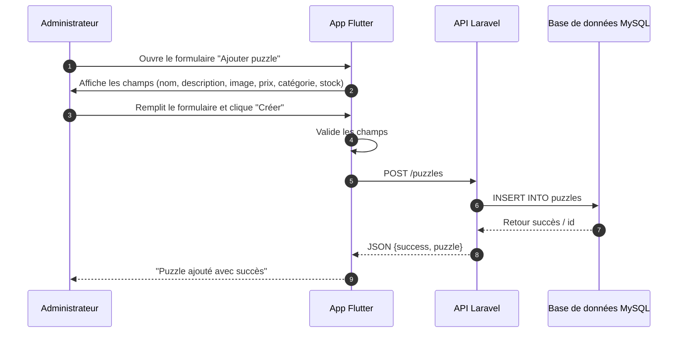

```mermaid
sequenceDiagram
    autonumber
    participant Admin as Administrateur
    participant App as App Flutter
    participant API as API Laravel
    participant DB as Base de données MySQL

    Admin->>App: Ouvre le formulaire "Ajouter puzzle"
    App->>Admin: Affiche les champs (nom, description, image, prix, catégorie, stock)

    Admin->>App: Remplit le formulaire et clique "Créer"
    App->>App: Valide les champs

    App->>API: POST /puzzles
    API->>DB: INSERT INTO puzzles
    DB-->>API: Retour succès / id

    API-->>App: JSON {success, puzzle}

    App-->>Admin: "Puzzle ajouté avec succès"
```